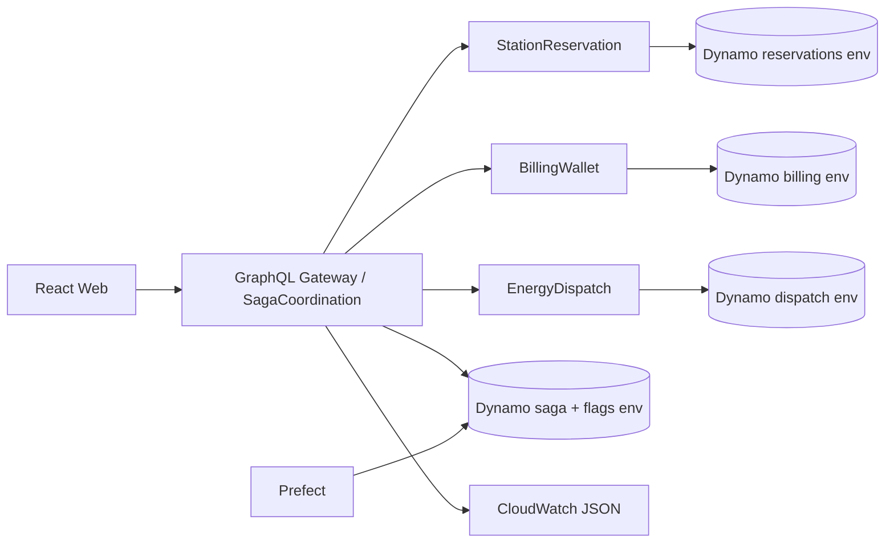

# C4 — contenedores

```mermaid
flowchart LR
Web[React Web] --> GQL[GraphQL Gateway / SagaCoordination]
GQL --> Station[StationReservation]
GQL --> Billing[BillingWallet]
GQL --> Dispatch[EnergyDispatch]
Station --> R[(Dynamo reservations env)]
Billing --> B[(Dynamo billing env)]
Dispatch --> D[(Dynamo dispatch env)]
GQL --> S[(Dynamo saga + flags env)]
GQL --> CW[CloudWatch JSON]
Prefect --> S
```
