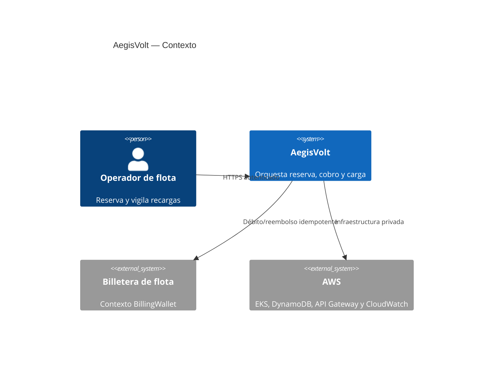

# C4 — contexto

```mermaid
C4Context
title AegisVolt — Contexto
Person(operator, "Operador de flota", "Reserva y vigila recargas")
System(aegis, "AegisVolt", "Orquesta reserva, cobro y carga")
System_Ext(wallet, "Billetera de flota", "Contexto BillingWallet")
System_Ext(aws, "AWS", "EKS, DynamoDB, API Gateway y CloudWatch")
Rel(operator, aegis, "HTTPS autenticado")
Rel(aegis, wallet, "Débito/reembolso idempotente")
Rel(aegis, aws, "Infraestructura privada")
```
