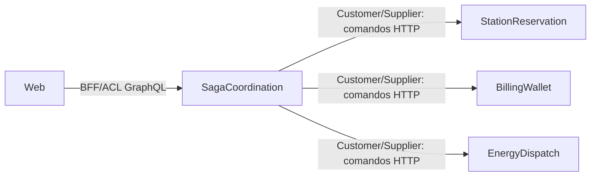

# DDD Context Map

```mermaid
flowchart LR
SC[SagaCoordination] -->|Customer/Supplier: comandos HTTP| SR[StationReservation]
SC -->|Customer/Supplier: comandos HTTP| BW[BillingWallet]
SC -->|Customer/Supplier: comandos HTTP| ED[EnergyDispatch]
Web -->|BFF/ACL GraphQL| SC
```

SagaCoordination es downstream de contratos explícitos. No hay Shared Kernel de bases de datos.
