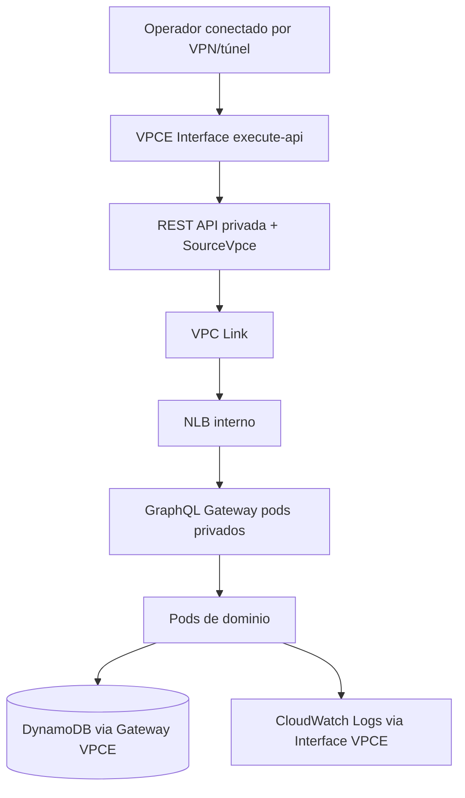

# Despliegue y red privada

```mermaid
flowchart TB
Client[Operador conectado por VPN/túnel] --> VPCE[VPCE Interface execute-api]
VPCE --> APIGW[REST API privada + SourceVpce]
APIGW --> Link[VPC Link]
Link --> NLB[NLB interno]
NLB --> GQL[GraphQL Gateway pods privados]
GQL --> Services[Pods de dominio]
Services --> DDB[(DynamoDB via Gateway VPCE)]
Services --> Logs[CloudWatch Logs via Interface VPCE]
```
