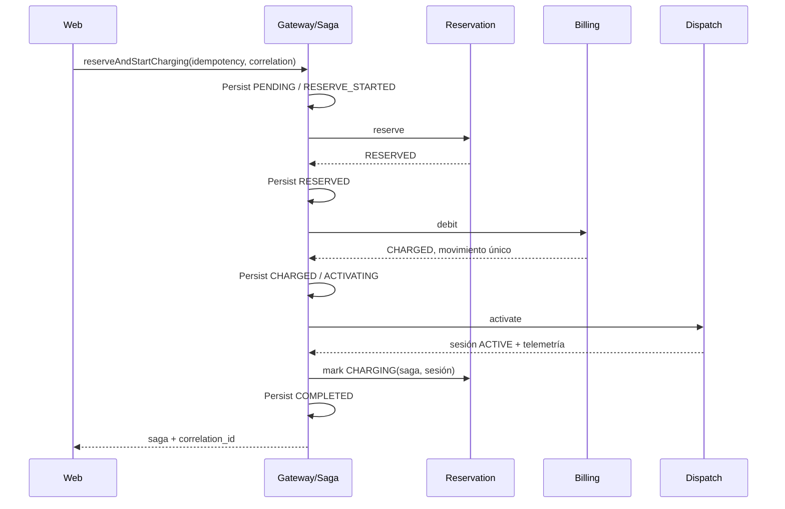

# Secuencia SAGA exitosa

```mermaid
sequenceDiagram
participant W as Web
participant G as Gateway/Saga
participant R as Reservation
participant B as Billing
participant E as Dispatch
W->>G: reserveAndStartCharging(idempotency, correlation)
G->>G: Persist PENDING / RESERVE_STARTED
G->>R: reserve
R-->>G: RESERVED
G->>G: Persist RESERVED
G->>B: debit
B-->>G: CHARGED, movimiento único
G->>G: Persist CHARGED / ACTIVATING
G->>E: activate
E-->>G: sesión ACTIVE + telemetría
G->>R: mark CHARGING(saga, sesión)
G->>G: Persist COMPLETED
G-->>W: saga + correlation_id
```
