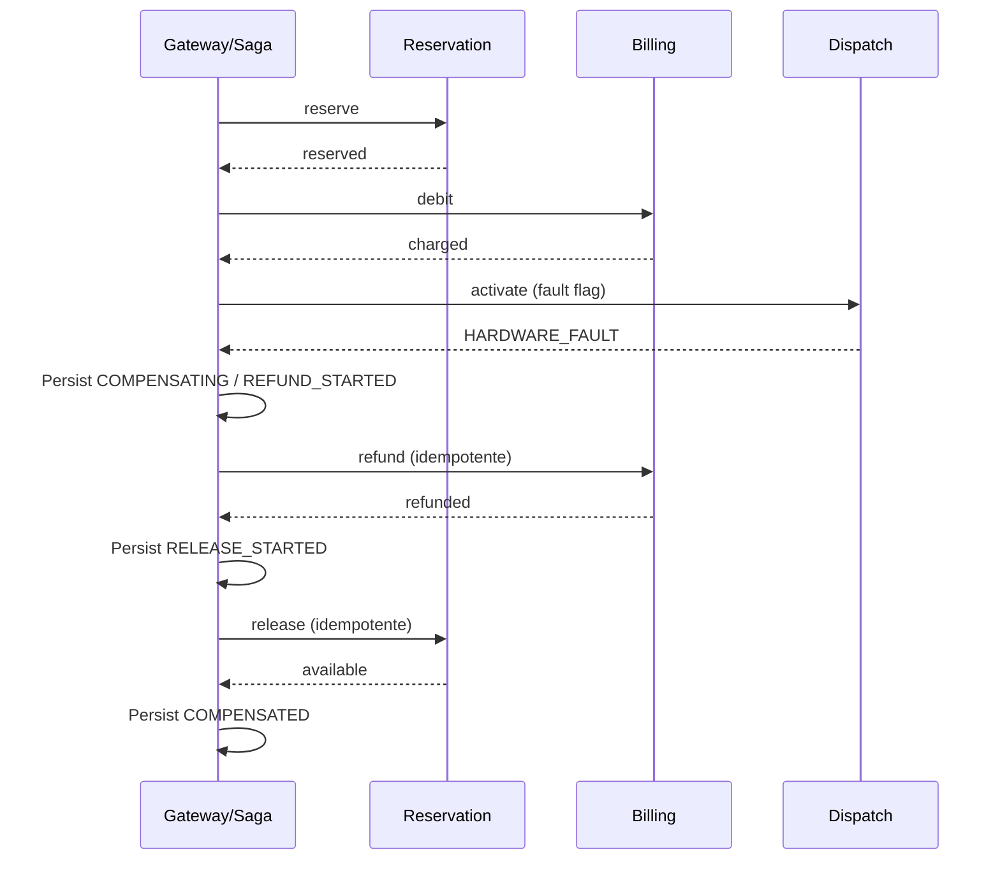

# Secuencia SAGA fallida en activación

```mermaid
sequenceDiagram
participant G as Gateway/Saga
participant R as Reservation
participant B as Billing
participant E as Dispatch
G->>R: reserve
R-->>G: reserved
G->>B: debit
B-->>G: charged
G->>E: activate (fault flag)
E-->>G: HARDWARE_FAULT
G->>G: Persist COMPENSATING / REFUND_STARTED
G->>B: refund (idempotente)
B-->>G: refunded
G->>G: Persist RELEASE_STARTED
G->>R: release (idempotente)
R-->>G: available
G->>G: Persist COMPENSATED
```
